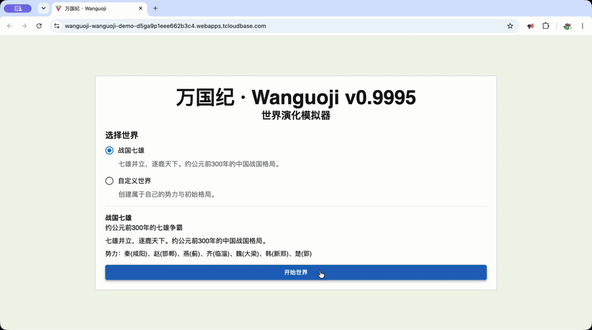
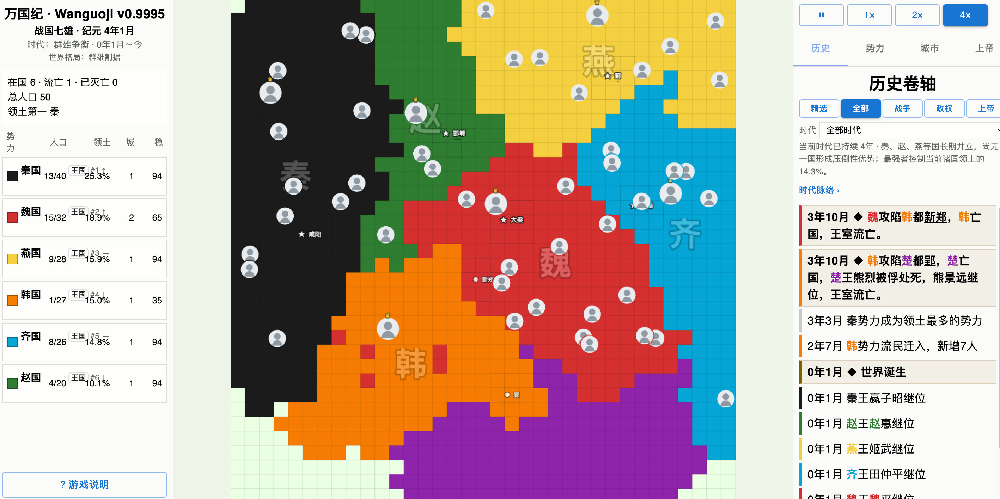
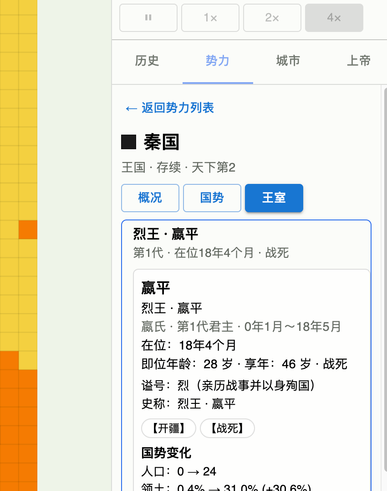
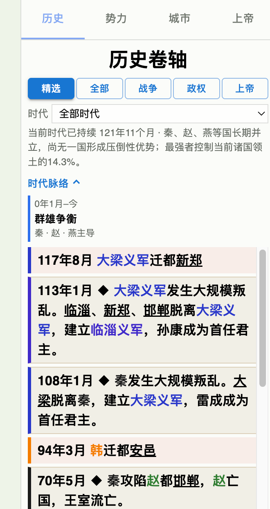

# 万国纪 · Wanguoji

**一个会自己书写历史的架空世界沙盘。**

你不控制任何国家。

世界会自行战争、扩张、建城、亡国、复国；义军可能建立新的国家，诸侯可能称王，强权可能称帝建立王朝，而王朝也可能衰落、分裂和再次统一。

城市、政权、君主、王朝与时代，都会留下可以回看的历史。

[English](README_EN.md)

## 🎮 在线试玩

**[打开《万国纪》在线试玩](https://wanguoji-wanguoji-demo-d5ga9p1eee662b3c4.webapps.tcloudbase.com/)**

当前为公开 Alpha，打开即可试玩，无需注册。当前链接是 CloudBase Public Alpha deployment，不是正式生产服务。游戏存档保存在本机 IndexedDB；部署站点需更新到对应版本后才可使用。



## 游戏截图



<p align="center">
  
  
</p>

## 30 秒怎么玩

《万国纪》不是传统的“选择一个国家然后微操”的策略游戏。

它是自主运行的观察型历史沙盘。

1. 选择一个世界场景。
2. 点击开始，让诸国自行发展。
3. 使用 1× / 2× / 4× 调节时间。
4. 点击国家、城市和君主查看其状态与历史。
5. 打开历史卷轴，观察争霸、统一、分裂和复国。

建议第一次至少观察 50～100 年。

## 核心特色

- 自动领土战争与扩张。
- 城市、围城、城市易主与首都迁移。
- 建城与历史城市档案。
- 叛乱与义军势力。
- `REBEL -> STATE` 的政权形成。
- 亡国、流亡、残部与复国。
- `KING` / `EMPEROR` 王权与帝权。
- 有期限的停战、互不侵犯与战略同盟；满足严格同源条件时可发生行政合邦。
- Dynasty、王室继承与复辟。
- ruler chronicle 君主传记与统治摘要。
- temple / posthumous names：庙号与谥号。
- WorldEra：长期天下时代与格局章节。
- HistoryScroll：可回看的历史卷轴。
- faction archive：灭亡、流亡、复国政权档案。
- 浏览器后台推进（Web Background Progression）：浏览器标签页切回前台后按真实离开时间补算历史。
- Electron 桌面版：awake 状态下持续运行，提供自动保存、安全关闭与系统休眠恢复补算。

## 试玩反馈

如果你发现 Bug、页面异常、某个势力或王朝行为明显不合理，或者长局历史节奏有问题，也欢迎提出值得加入的玩法建议，欢迎通过 [GitHub Issues](https://github.com/TimVan1596/wanguoji/issues) 反馈。

提交反馈时，尽量告诉我们：

- 游戏版本
- 使用的场景
- 世界年份
- 截图
- 发生了什么

## 当前 Alpha 状态

当前版本是 Public Alpha 发布候选。

已经存在：

- Web 版核心玩法。
- 城市、王朝、政权生命周期和历史卷轴。
- Chrome 浏览器后台推进（切回前台后补算历史）。
- Electron 桌面运行时基础（尚待长时间人工验收）。

浏览器版本当前尚未包含：

- 云端存档、跨设备同步或存档文件导入导出。
- 可指定世界种子以复现相同配置下的随机序列；完整 replay 工具尚未提供。
- 经济系统。
- 科技树。
- Desktop installer packaging foundation；签名/notarized public distribution 与自动更新尚未配置。

## 本地运行

推荐环境：

- Node.js 20 LTS（Node 18+ 应可运行；当前本机和 CI 使用 Node 20）。
- pnpm 8.x（项目当前 `packageManager` 为 `pnpm@8.5.1`）。
- Chrome / Edge 等现代 Chromium 浏览器。

```bash
pnpm install
pnpm dev
```

浏览器打开：

```text
http://localhost:5173/
```

## 构建

```bash
pnpm test
pnpm build
```

生产构建产物输出到 `dist/`。

## 浏览器后台推进（Web Background Progression）

普通浏览器模式使用 `WEB_CATCH_UP` 策略。

当 Chrome tab 被切到后台时，《万国纪》不试图强迫浏览器持续 30Hz 渲染。页面回到前台后，系统会根据真实离开时间、暂停状态和 1× / 2× / 4× 速度，把欠下的时间转换为同一套 authoritative Phaser Arcade Physics + SimulationDriver fixed steps，并分块追赶。

这不是只快进 `worldMonth`。城市围攻、领土变化、死亡、继承、建国、称帝、WorldEra 和 HistoryScroll 都通过真实模拟路径推进。

手动保存后，可在刷新页面进入主菜单时选择“继续上次世界”。Web 中未手动保存的推进不会自动保留；Electron 桌面版另有定时自动保存。

## Electron 桌面运行时

Electron 运行时直接承载当前 React + Phaser frontend，不复制 gameplay 源码。使用 [desktop/](./desktop/) 中的入口：

```bash
pnpm desktop:start
```

Desktop-first、Web-compatible：Desktop 是 long-run、background 与 persistence 的主要人工验收环境。推荐长局使用 `pnpm desktop:start`；诊断使用 `pnpm desktop:start:debug`，plain avatar A/B 使用 `pnpm desktop:start:debug:plain`，noFace PNG texture probe 使用 `pnpm desktop:start:debug:png`。开发使用 `pnpm desktop:dev`，诊断开发使用 `pnpm desktop:dev:debug`（plain A/B：`pnpm desktop:dev:debug:plain`；PNG probe：`pnpm desktop:dev:debug:png`）。Web 继续作为 online demo 与兼容性目标，并未废弃。

Desktop 打包：`pnpm desktop:pack` 生成目录包；Apple Silicon Mac 使用 `pnpm desktop:dist:mac` 生成 arm64 `.app/.dmg/.zip`；Windows x64 `.exe` 必须由 Windows runner 构建。无签名凭据时产物为 unsigned，macOS Gatekeeper 可能提示阻止打开。安装版 IndexedDB 跨重启/同 appId 更新的持久性尚待人工验收。

存档管理支持 UUID 手动档、两个按每 200 游戏年轮换的自动档，以及兼容旧 `current` key 的恢复档。Continue 会从最近保存的有效槽位继续。Electron 仍每 5 个现实分钟更新恢复档，并在关闭窗口前安全保存；Web 使用本机 IndexedDB，不提供云端同步。Desktop 模式使用 `DESKTOP_CONTINUOUS`：窗口最小化、失焦或被遮挡时仍持续运行。系统休眠策略默认为 PAUSE（睡眠时间不计入世界时间；唤醒后若休眠前正在运行，则自动暂停并提示用户手动继续，原选中速度保留），也可选择受限 catch-up。Desktop 与 Web 共用同一份 React + Phaser gameplay，不维护桌面玩法分支。

更多说明见 [desktop/README.md](./desktop/README.md)。

## 当前已知问题

- v0.99930 新增国家终身月度峰值与终结国评，王室可查看，历史终结事件提供简短回顾。当前仅接受 WorldSave V12，V11及更旧不迁移；请创建新世界完成 [Faction Historiography Gate](docs/FactionHistoriography.md)。
- v0.99929a 修复政治终结历史身份、退位年龄与双方君主大事记。[Political Terminal Chronicle Gate](docs/PoliticalTerminalChronicleClosure.md)已由用户完成人工PASS。
- v0.99929新增不同源正式国家的和平纳土。独立终结原因SUBMITTED，与同源合邦MERGED及战争覆灭区分；末代君主退位、旧王室保留。[Peaceful Submission Gate](docs/PeacefulSubmission.md)已人工PASS，规则冻结。
- 当前WorldSave **V12**，V11及更旧直接拒绝，不迁移；IndexedDB版本仍2。Diplomacy II全系列已人工PASS并冻结，期限/威胁/续约/冷却及Strategic Union条件不变。
- v0.99927 Dynastic Revolution 系列已由用户完整人工通过并冻结，包括历史身份、时代筛选、旧V9安全修复及重新保存后零修复读档。


- v0.99927d2阻断修复：永久城市销毁后不再重新挂载zone；存档导出及读取前校验active-city引用。旧V9仅对明确已归档城市的stale block指针进行副本恢复，未知引用安全拒绝、不拆当前世界。时代筛选仅显示世界级事件。已通过 [Persistence Integrity + Era Filter Gate](docs/PersistenceIntegrityEraFilter.md)。

- v0.99927d1：历史卷轴增加“大事→易代”等结构化筛选与新事件提示。请用含822年4月真实篡朝的现有V9存档完成 [History Major Events + Revolution Gate](docs/HistoryMajorEventsRevolutionGate.md)，该历史/宗谱/存读档语义 Gate 已人工通过。

- v0.99927d Calibration Closure：最高继承危机概率不变，shock／instability仅在“前君战死或被俘＋仅余一城”时开放折扣入口；新增会话期望频率诊断。1005年人工长局已自然产生一次篡朝，校准冻结；事件语义视觉验收已通过。2445年低FPS／unlock卡顿为known performance debt，本版不处理。

- 历史版本v0.99927d2使用WorldSaveV9；当前v0.99930仅接受V12，V11及更旧无法继续。IndexedDB 数据库版本仍为 2。首领诊断与 Revolution Gate 累计诊断的本会话样本在新世界／读档时重置，后者仅在 debug 模式观察，不写入存档。首领诊断的最近 100 年窗口按任期结束月份筛选。

- v0.99927b1 disposal 已通过新世界 desktop debug 4×约1962年人工测试：无 `.size`／Renderer Fatal／disposal stalled，运行时资源 invariant 正常。本版保留该生命周期修复。
- v0.99927b2 History Scalability 已人工通过，4228年／约10k历史事件存档Load后仍可恢复60～65 FPS；历史与disposal修复继续保留。原History测量见 [HistoryFrameScalability](docs/HistoryFrameScalability.md)。
- v0.99927b3 前台追债已人工通过；有界accumulator及原速度保持。细节见 [ForegroundPacingDebtRecovery](docs/ForegroundPacingDebtRecovery.md)。
- v0.99927b5两种opt-in锁屏实验已人工可用，v27b性能审计结束；release／普通debug仍默认RAF、blocker OFF，不再继续scheduler调试。结果见 [macOS Scheduler A/B](docs/MacOSLockScreenSchedulerAB.md)。
- v0.99927c取消稳定度<=25硬门后，2445年人工样本已确认机制可抽签，但最高危机入口仍很稀少。本轮v0.99927d扩展仅有真实复合证据的低风险入口，并以期望频率辅助验收；每eligible boundary最多一次draw。

- Web 存档仅保存在当前浏览器 IndexedDB；无云存档或跨设备同步。手动档、200 游戏年轮换自动档与 `current` 恢复档共用当前版本化 WorldSave schema。
- Web 中未触发存档的推进在刷新或关闭页面后不会保留；Electron 另有每 5 现实分钟恢复档和关闭前保存。
- 尚无完整 deterministic seed / replay。
- 浏览器后台推进是切回前台后的时间补算，不是隐藏标签页持续渲染。
- Electron 运行时尚未完成用户在 macOS / Windows 的长时间人工验收。
- Electron 在中国大陆网络下下载 binary 可能需要镜像，例如 `ELECTRON_MIRROR=https://npmmirror.com/mirrors/electron/`。
- long-run balance 仍持续调整。
- Vite build 目前会出现 large chunk warning，但不是构建失败。

## 技术栈

- React 18
- Phaser 3.55 Arcade Physics
- Redux Toolkit
- Vite
- TypeScript
- Vitest
- Electron desktop runtime（unpackaged）

## 项目来源 / Credits

《万国纪 · Wanguoji》源自 [KeJunMao/open-block-war](https://github.com/KeJunMao/open-block-war)，原项目使用 MIT License。

《万国纪 · Wanguoji》在此基础上加入了大量新的 autonomous simulation、city systems、faction lifecycle、dynasties、rulers、historical archives、WorldEra、background progression 和 desktop experimentation 工作。详见 [NOTICE.md](./NOTICE.md)。

资产来源和待确认项见 [ASSET_ATTRIBUTION.md](./ASSET_ATTRIBUTION.md)。

## License

MIT License。详见 [LICENSE](./LICENSE)。

原始版权声明保留在 LICENSE 中。

## 参与贡献

欢迎 issue、bug report、长局 balance feedback 和小型 PR。

请先阅读 [CONTRIBUTING.md](./CONTRIBUTING.md)。

路线图见 [ROADMAP.md](./ROADMAP.md)。

Desktop scheduler实验保留为debug／compatibility选项（blocker／timeout），不更改默认行为。本版按默认`pnpm desktop:start:debug`进行王朝易代人工Gate，不要求重复A/B。
