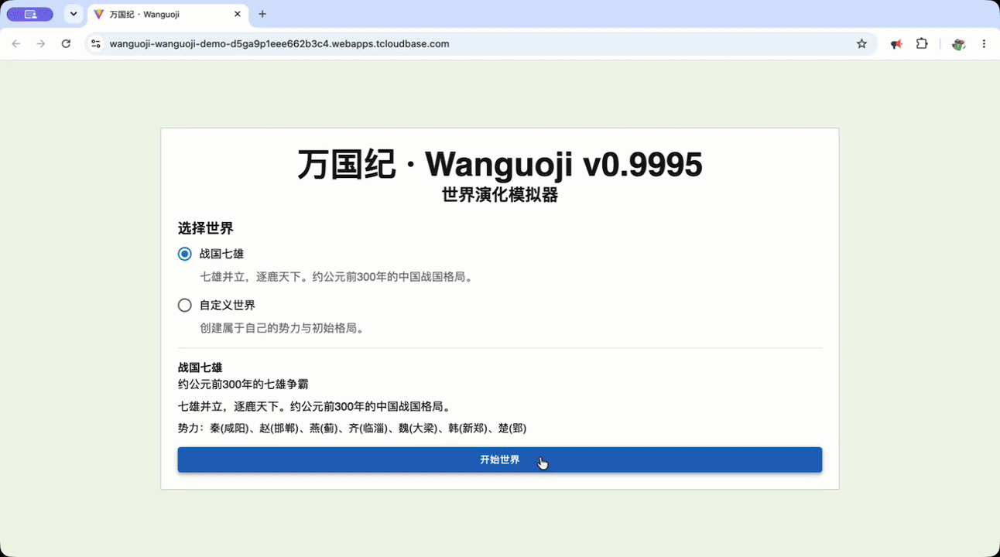
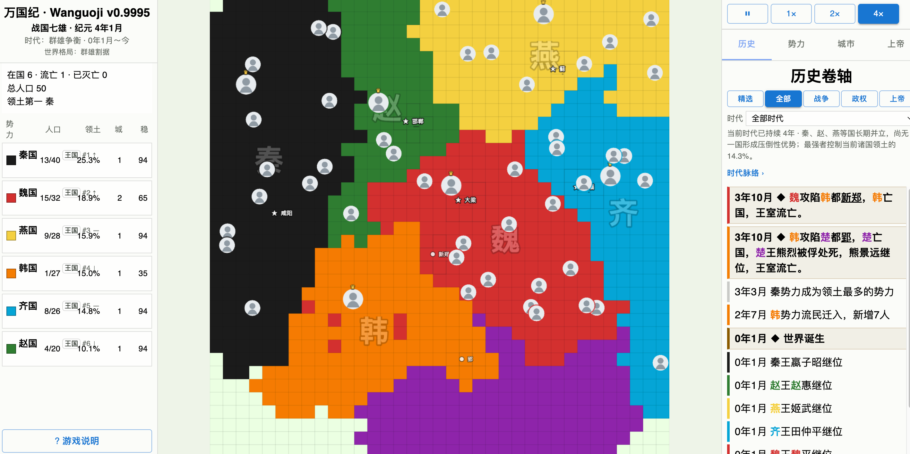
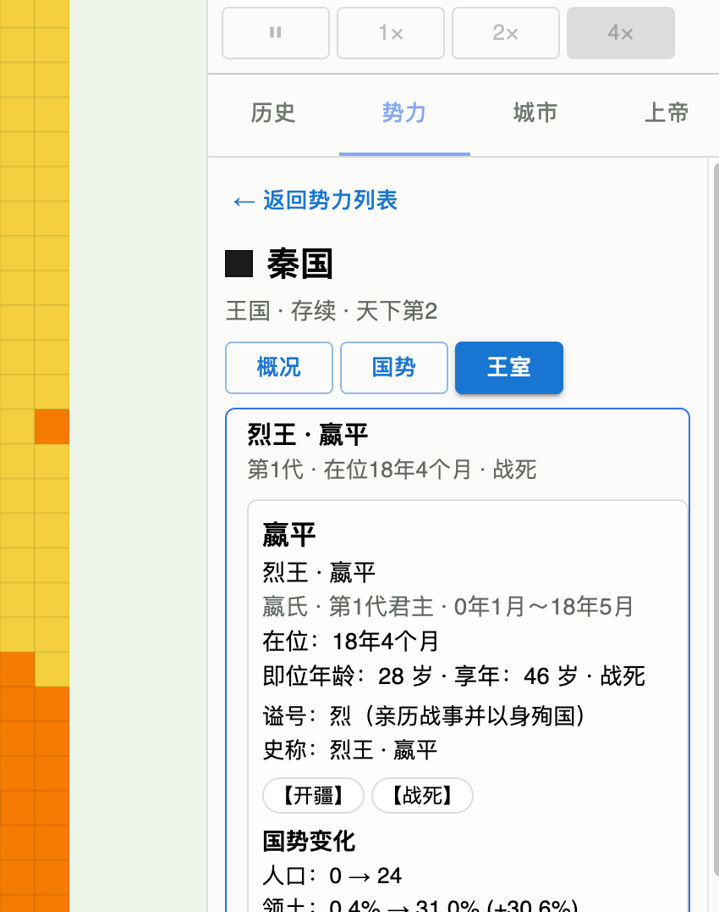
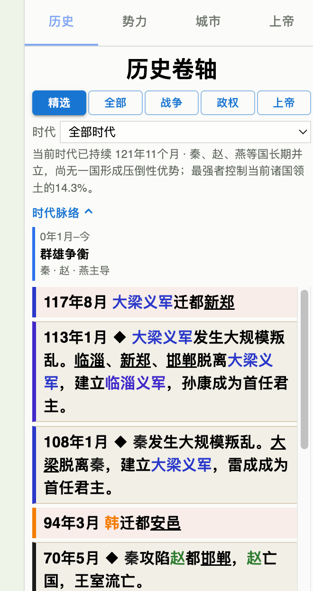

# Wanguoji

**An autonomous world that writes its own history.**

Wanguoji is an open-source alternate-history sandbox where you do not control a nation.

States expand, wage war, build cities, collapse and return. Rebels may found new states. Kings may become emperors. Dynasties may unify the world — and eventually fracture again.

Cities, rulers, dynasties and historical eras leave behind a readable chronicle of the world that emerged.

[简体中文](README.md) · [Play Online](https://wanguoji-wanguoji-demo-d5ga9p1eee662b3c4.webapps.tcloudbase.com/)

**Public Alpha Web Demo** · [Launch the Wanguoji demo](https://wanguoji-wanguoji-demo-d5ga9p1eee662b3c4.webapps.tcloudbase.com/)

This is the current CloudBase Public Alpha deployment for public playtesting and feedback. It is not production-ready, a stable service, or permanent hosting.

> Full Save / Continue is not available yet. Refreshing the page starts a new world.



## Screenshots



<p align="center">
  
  
</p>

<!-- Demo GIF placeholder: docs/media/wanguoji-demo.gif -->

## How to play in 30 seconds

Wanguoji is not a traditional strategy game where you pick a nation and micromanage it.

It is an autonomous historical observation sandbox.

1. Choose a world scenario.
2. Start the world and let the states develop on their own.
3. Use 1× / 2× / 4× to adjust time.
4. Click states, cities and rulers to inspect their status and history.
5. Open the history scroll to watch rivalry, unification, fragmentation and restoration.

For a first run, watch at least 50–100 years.

## Features

- Autonomous territorial warfare.
- Cities, sieges, captures and capital relocation.
- City founding and historical city records.
- Rebellion and rebel factions.
- `REBEL -> STATE` state formation.
- Extinction, exile, remnants and restoration.
- `KING` / `EMPEROR` political ranks.
- Dynasties, succession and restoration.
- Ruler chronicle and reign summaries.
- Temple and posthumous names.
- WorldEra long-run historical chapters.
- HistoryScroll with readable historical records.
- Faction archive for fallen, exiled and restored states.
- Web Background Progression via return-time catch-up.
- Experimental Electron Desktop probe.

## Alpha status

Wanguoji is now in its first Public Alpha.

Current limitations:

- No full Save / Continue World system.
- Refreshing or closing the page loses the current full world.
- No deterministic seed / replay system.
- Web Background Progression is return-time catch-up, not continuous hidden-tab rendering.
- Electron Desktop is still experimental.
- Electron continuous background still needs final user validation.
- Long-run balance is still being adjusted.

## Playtest feedback

If you find a bug, a broken page, implausible faction or dynasty behavior, an odd long-run historical rhythm, or have a gameplay suggestion, please open an issue on [GitHub Issues](https://github.com/TimVan1596/wanguoji/issues).

If possible, include the game version, scenario, world year, a screenshot, and what happened. No complex development information is required.

## Local development

Recommended:

- Node.js 20 LTS. Node 18+ should generally work.
- pnpm 8.x.
- Chrome / Chromium browser.

```bash
pnpm install
pnpm dev
```

Open:

```text
http://localhost:5173/
```

## Build

```bash
pnpm test
pnpm build
```

## Electron Desktop Experimental

```bash
pnpm desktop:dev
```

See [desktop/README_EN.md](./desktop/README_EN.md).

## Deployment

The Web app is a static Vite build. See [docs/DEPLOY_CLOUDBASE.md](./docs/DEPLOY_CLOUDBASE.md).

## Credits

Wanguoji is derived from [KeJunMao/open-block-war](https://github.com/KeJunMao/open-block-war), originally licensed under the MIT License.

See [NOTICE.md](./NOTICE.md) and [ASSET_ATTRIBUTION.md](./ASSET_ATTRIBUTION.md).

## License

MIT License. See [LICENSE](./LICENSE).

## Contributing

See [CONTRIBUTING.md](./CONTRIBUTING.md).

See the [roadmap](./ROADMAP.md) for planned priorities.
